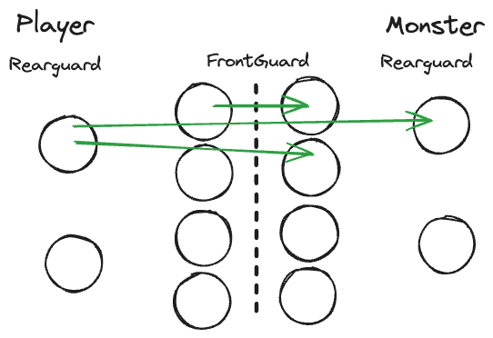

# Combat

Combat is resolved in the following way:

## Engagement
The party can choose to:

- Immediately attack
- Try to talk to the monsters
- Try to sneak past them

If they choose to attack, initiate combat. If they choose to talk, roll for the monsters' reaction. If they choose to sneak, handle it as a stealth check.

## Rounds
Each round is played as follows:

1. The characters resolve their actions first.
2. Then the monsters take their actions.

### Character Actions

Characters can take a variety of actions on their turn:

- Attack a monster group with a melee or ranged weapon.
- Use an item.
- Cast a spell.
- Use a class ability.
- Move to a different position. See [Positioning & Stance](#positioning--stance) for more information.

#### Attacking a Monster Group

The character can choose to attack a monster group with a melee or ranged weapon that they have. 

#### Melee Attack

The character rolls their vigor die against the monster group's defense value plus any modifiers from abilities or items. If the character's roll exceeds the monster group's defense value, they hit the monster group. For every multiple of the monster's defense value the character rolls, they hit the monster group an additional time. Each hit kills one monster in that group. 

An example of this would be a character with a D6 vigor attacking a set of four Gobbo's with a defense of three.

 - If the character rolls a 2, they miss the monster group.
 - If the character rolls a 4, they hit the monster group once killing one of them. 
 - If they roll a 6, they hit the monster group twice killing two of them.

A character can only attack a monster group in the front guard if they are in the front guard unless they have a special ability.

#### Ranged Attack

The character rolls their quick die against the monster group's defense value plus any modifiers from abilities or items. If the character's roll exceeds the monster group's defense value, they hit the monster group. For every multiple of the monster's defense value the character rolls, they hit the monster group an additional time. Each hit kills one monster in that group.

A character can only use a ranged attack in the rear guard against either the front guard or the rear guard of the monsters unless they have a special ability that says otherwise.

### Using an Item

To use an item, the character must have the item in their inventory. They can use the item to heal themselves, buff themselves, or debuff the monsters. The item will have a description of what it does.

### Casting a Spell

Follow the rules for casting a spell in the [Magic](magic.md) section.

### Using a Class Ability

Each class has a set of abilities that they can use. These abilities can be used in combat to help the party. The abilities will have a description of what they do.

### Moving to a Different Position

The character can move to a different position in the party formation. If there is space available in the front guard, they can move there. If there is space available in the rear guard, they can move there. If there is no space available, they must stay where they are.

## Monster Actions

Then the monsters attack. Each monster picks a character to attack, starting with the one that did the most damage to them last round. The character rolls the applicable die for their defense. If they roll over the monster's attack value, they dodge the attack. If they roll equal to or under the monster's attack value, they take damage

## Positioning & Stance

During combat the party can choose to strategically position themselves using an abstract positioning system. Characters & opponents can be either positioned in the front guard or the rear guard. The front guard is the whirling melee between the party and their opposition. The rear guard is where the ranged combatants ands spellcasters are positioned. While not strictly representing the physical location of the characters, it does represent the tactical advantage of the party.

The number of people in the front determine the number of people allowed in the rear. By default the party can have one person in the rear for every two people in the front. This can be modified by room characteristics or character abilities.

An example battle map might look like this, with green arrows representing where a character in that position can attack:

_Note: Vertical positioning currently has no impact on combat._

Each character can choose a stance at the beginning of the round:

- Front guard Stances
    - Aggressive Stance: +1 to attack, -1 to defense
    - Defensive Stance: +1 to defense, -1 to attack
    - Neutral Stance: No bonus or penalty

- Rearguard Stance:  Rearguard characters can only be attacked if their front guard is outnumbered or by the oppositions rear guard. 

The party formation works as follows:
- For every character in the Rearguard, there must be two characters in the Front Guard.
- This may be modified by room size or character and monster abilities.

This stance and formation system allows the party to strategically position themselves for combat, balancing offense and defense as needed.

### Monster Positioning

- By default, all melee-focused monsters are in the Front Guard.
- Ranged-focused monsters are in the Rearguard.
- Monsters with equal melee and ranged capabilities are in the Front Guard.